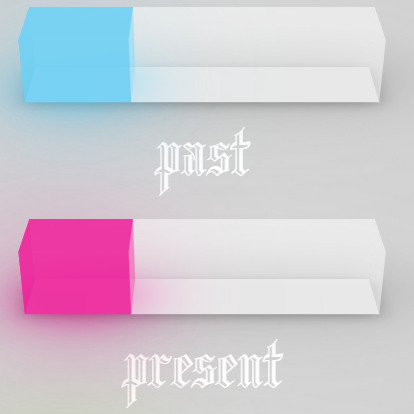
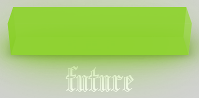
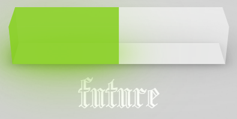

# reed-lightpaper
Light represents the amount of arcana energy that is available to be used to complete spiritual goals. Different decks can either add to light, or, not contribute to light at all. In the defualt platform spread, light is measured in time-contexts where users pull cards for the past, present, and future. For future custom spreads, the light pulled accumulates in the selected time-context, but defaults to present.

## Pace
The platform averages 7.5 card pulls per 28 days to be the default norm, and bars will represent fullness based on this metric.

# Default Light
As a Querent, I begin my light on reed at ~30%.
 

# Accumulating Light
As a Querent, when I select a card, my light accumulates to 100%.
 

# Declining Light
As a Querent, as I select more cards might light diminishes as a spread my memes more thinly.

# Analysis
### Indvidual
As a user, I can interrupt my light in various different time-contexts - namely, past, present, & future - in order to make decisions about where I should be placing value.

### Commmunity
As a user, I can opt into sharing my light to the community when I upload a review to the platform for a specific card deck so that context on how decks can be formed can contribute to the current pace of reed users. The hypothesis is that with more transparency, more collective light can be spread amongst tarot readers, whereby light can be boosted for individuals & measured against others who perform this stake. Calculations to be completed.
